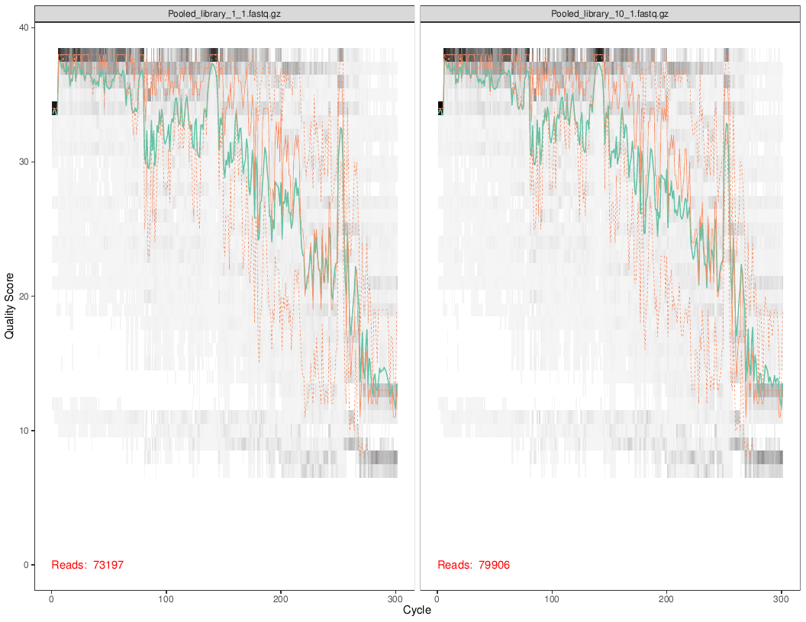
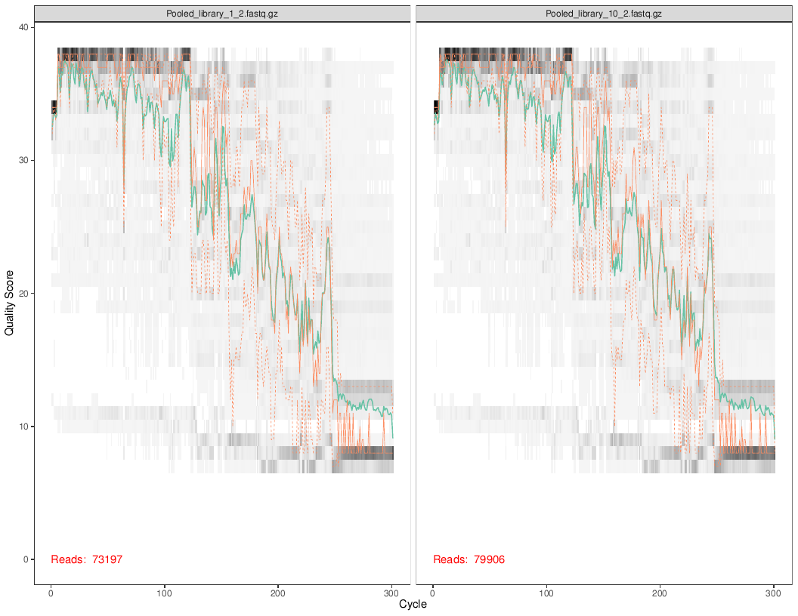
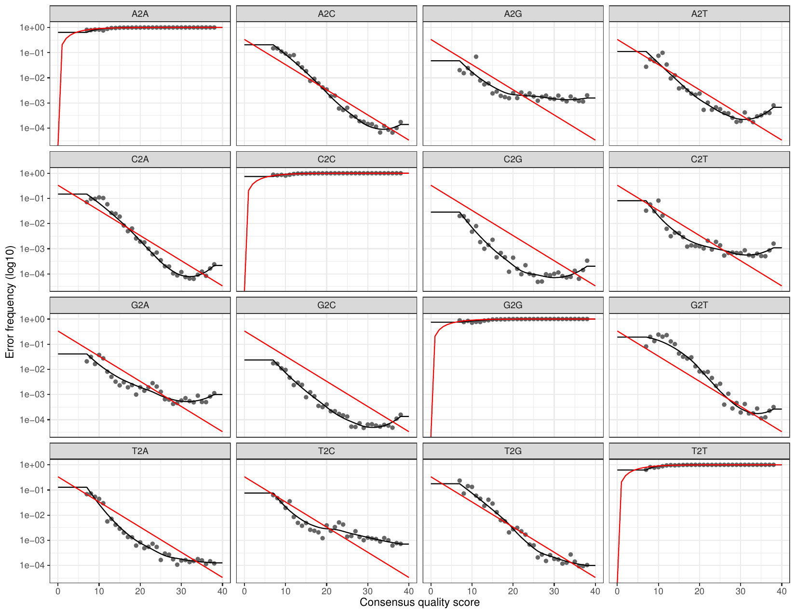
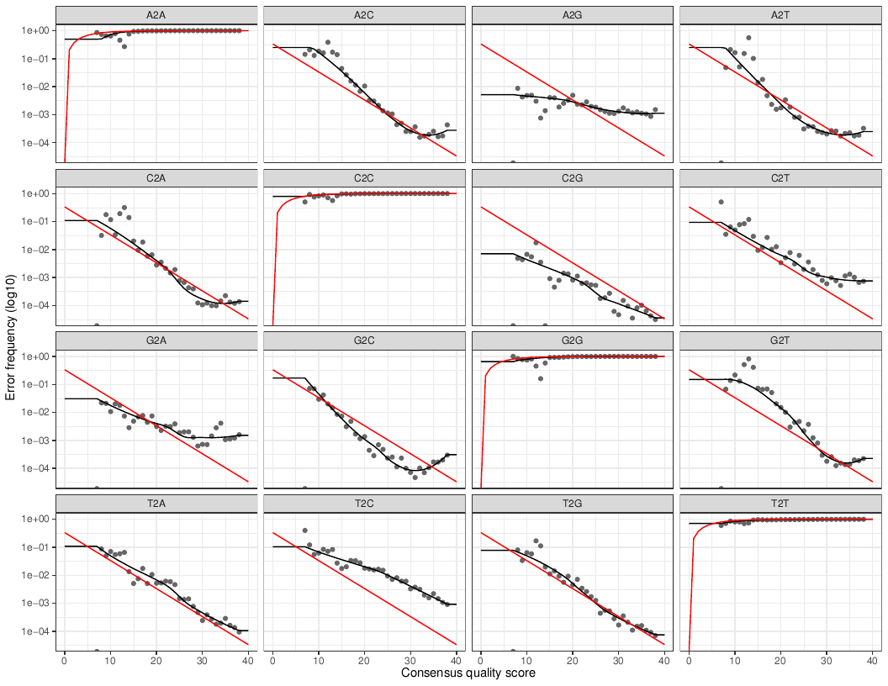

**This document is designed to explain the process needed to take genenetic sequences and turn them into workable data that is ready for analysis.**   
  
**This process has steps:**  

* **DADA 2 (not the disease)**   
* **Phyloseq**   
* **c**  
* **d**  

---------------------
#### **DADA 2**  
    
Our starting point is a set of Illumina-sequenced paired-end fastq files that have been split (or “demultiplexed”) by sample and from which the barcodes/adapters have already been removed. The DADA2 package denoises and removes sequencing errors from this sequence data. The resulting amplicon sequence variant (ASV) table records the number of times each sequence variant was observed in each sample. This provides a census of a community. We then assign taxonomy, and import the information into the phyloseq package for the analysis of microbiome data.  

First, prepared fastq files are checked for quality by visualizing the quality profiles of both the forward and reverse reads.  


The forward read quality (top) is not great, and the reverse read quality (below) is even worse. Luckily for us, the next step is to filter by the maximum number of “expected errors” allowed in a read with the maxEE parameter.
```{r, echo=TRUE, eval=FALSE}
out <- filterAndTrim(fnFs, filtFs, fnRs, filtRs, truncLen=c(250,160),
                     maxN=0, maxEE=c(2,2), truncQ=2, rm.phix=TRUE,
                     compress=TRUE, multithread=TRUE) 
```

The error rate of the filtered data is then measured. The learnErrors method learns this error model from the data, by alternating estimation of the error rates and inference of sample composition until they converge on a jointly consistent solution. 


The error rates for each possible transition (A→C, A→G, …) are shown. Points are the observed error rates for each consensus quality score. The black line shows the estimated error rates after convergence of the machine-learning algorithm. The red line shows the error rates expected under the nominal definition of the Q-score. Here the estimated error rates (black line) are a good fit to the observed rates (points), and the error rates drop with increased quality as expected. 

Dereplication: DADA2 retains a summary of the quality information associated with each unique sequence. The consensus quality profile of a unique sequence is the average of the positional qualities from the dereplicated reads. These quality profiles inform the error model of the subsequent sample inference step, significantly increasing DADA2’s accuracy.
